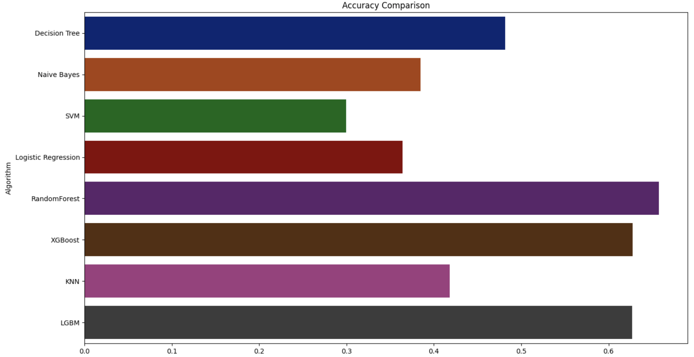

# DSS_Group6
## 主程式 (DSS_project.ipynb)
User 輸入土壤資訊，使用 Random Forests 預測最適的種植作物推薦給 User，提供農業社區一個先進的工具，幫助農民在開始種植作物之前做出明智的決定，來提高生產力、節省資源並實現可持續的農業實踐。  
系統說明：
a. 系統目標：幫助農民能夠依據自身土壤的條件來選擇出適合種植的農作物，成為一個易用的工具，提供科技支持，促進可持續的農業實踐。
b. 系統描述：讓使用者輸入土壤條件，再利用隨機森林做出分析，最後推薦使用者適合種植的農作物。
c. 系統框架：
## 模型測試程式(DSS_MultipleModels.ipynb)
使用 Decision Tree、Naive Bayes、SVM、Logistic Regression、RandomForest、XGBoost 、KNN、LightGBM。(測試後挑選準確度最高的模型) 
測試結果準確度最高模型：Random Forests

